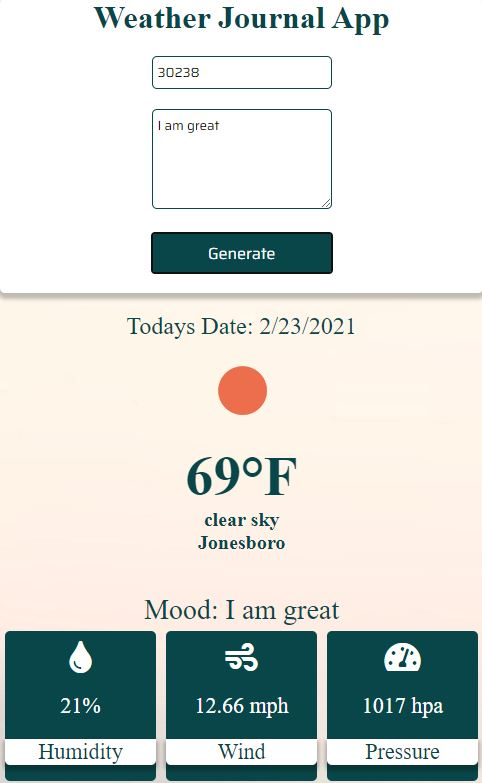

# WeatherApp

Weather Journal App

Create an asynchronous web app that uses Web API and user data to dynamically update the UI for a Weather-Journal App.

Learning Node.js was a great experience. In order to better understand the code and each aspect I did the project once and then started from scratch again and coded it again.

The second time I was able to learn and practice alot of things. Such as reading console errors in chrome dev tools, understanding the network tab, figuring out why my posts and gets were not working.

I actually spent almost 2 hours trying to figure out why my UI info was returning undefined only to realize I missed an await right before the request.json() on line 73 which was fun. Overall, the project was really interesting and I was excited to do more javascript in this project.
 
 
 
 
